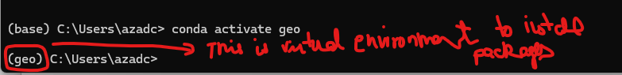

## Introduction

Azad Chahal, PhD II Agricultural and Biological Engineering II Penn State👋

- 🔭 I’m currently working on Digitalization Farming and Solutions 
- 👯 I’m looking to collaborate on project regarding data science on Farm Managements
- 🌱 I’m currently learning GIS Software Development
- 🤔 I’m looking for help with Ag Data science projects
- 💬 Ask me about: Data Analytics, Data-Driven Modals, ADO, Ag Tech and Digitalization
- 📫 How to reach me: azadchahalpau@gmail.com

## Projects (How to add hyperlinks, Toggle Hyperlink or Control + L)
- GIS Software Development: A Python package for interactive mapping with Google Earth Engine
- [geemap](https://geemap.org): A Python package for interactive mapping of Google Earth engine 
- [leafmap](https://leafmap.org): A Python package for interactive mapping with folium, ipyleaflet, and ipwidgets.
- GitHub Profile repository: azadchahal (https://github.com/AzadChahal/azadchahal) 
- Personal Website (azadchahal.github.io) repository from GitHub : azadchahal.github.io (https://github.com/AzadChahal/azadchahal.github.io)
- Python Package Repository; digitaldatai: https://github.com/AzadChahal/digitaldatai

## Demos (How to add images), 
Ag _ Science_ Data!


You have to plant first!

 


## Some useful links

Cookiecutter template for a Python Package : https://github.com/cookiecutter/cookiecutter

GitHub repo: https://github.com/opengeos/cookiecutter-pypackage

Documentation: https://open.gishub.org/cookiecutter-pypackage

Free Software: BSD license

## Resources and Steps: 

1. Visual Studio Code
    - Download from https://code.visualstudio.com
        - Download and then Install
        - While installing, recommended add below two options as well
            - Select Additional Tasks
                - Checkmark Add "Open with Code" action to Window Explorer file context menu
                - Checkmark Add "Open with Code" action to Windows Explorer directory context menu
    - You can check for version from Help
    - Recommended VS Code extensions: 
        - Python
        - Jupyter
        - GitHub Copilot 
        - GitHub Copilot Chat
        - GitHub Pull Requests and Issues
        - GitHub Pull Requests and Issues
        - Code Spell Checker
        - CodeSnap
        - Markdown Shortcuts
        - GitLens
        - Prettier - Code formatter
        - auto-Docstring Python Docstring Generator
        - Material Icon Theme
    - If your VS Code terminal does not work, Run Windows PowerShell as administrator and paste Set-ExecutionPolicy Unrestricted into the Powershell. Hit Enter and Type A (Yes to All)

2. Git
    -  Git is a software. It is a free and open source distributed version control system designed to handle everything from small to very large projects with speed and efficiency
    - Download from https://git-scm.com
        - Download Standalone Installer
        - Save and Install
        - While Installing, 
            - Choose the default editor used by Git
                - Use Visual Studio Code as Git's default editor
            - To Check if it is successfully installment, 
                - You can launch Git Bash if you want
                - Another way check in your "Terminal"
                    - Type git and then hit enter and see it is successfully installed
    - Common Git commands
        - Git Configuration
            - gitconfig--global user.name "Your Name"
            - git config-- global user.email "you@someplace.com"
            - git config--global--list
            - git clone https:/github.com/USERNAME/REPONAME.git
        - Git Initialization
            - gitinit[project-name]
        - Git Commmit
            - git add.
            - git commit-m "comment message"
            - git status
            - git push
            - git config credential.helper store
            - git pull
        - Git Branch
            - git checkout-b feature
            - git status
            - git add.
            - git commit-m "message"
            - git push       
    - Sign up for a GitHub account at https://github.com
3. Miniconda
    - Download https://docs.conda.io/en/latesh/miniconda.html
    - Download and Install
        - Install to all default setting
    - Conda is a package manager. It allows to create virtual environment
    - Ex: you can create as many virtual environment you want.

- What all these softwares are doing? 
    - Vizio Studio Code: Environment to write code
    - Git: Can connect to git hub. Can help pull changes
    - Conda: Helps to create virtual environments. To test the features

- Install packages 
    - Testing in Terminal
    - (base): 
    - conda hit enter, no error then it's good
    - 
    - To check the environments, ```conda env list```
    - To create a new environment, ``` conda create  -n geo python ```
    - To activate a package, ```conda activate geo```
    - 
    - To install a new package, ```conda install - c conda - forge mamba```
    - To install a package from Git ```pip install git+ url```
    - To install package locally 
        - '''down zip, 
        - unzip the directory by extract all
        - project folder
        - go the files and click to open the Terminal, 
        - Or copy the path of the directory
        - Go to Terminate, having your conda directory activated
        - cd + paste the navigation
        - Next line type ``dir```
        - type ``` pip install .``` Period mean install from local computer
    - To upgrade the package ```pip install -U package name```
 
 4. The name of the package (thescienceai or digitaldataai)

 5. Python Packages repository
    - PyPi: https://pypi.org/
        - numpy.org

    - Condaforge: https://conda-forge.org

6. Create your website from GitHub
    - Create a new repository
    - Set unique username: abc
    - License Type: MIT license
    - Finally go to Action Tab and wait it got deployed
    - Website template available now: https;//html5up.net/
    - If interested (not required) get domain name from GoDaddy website
  
7. GitHub Profile
    - Create a new repository
    - Repository Name: abc
    - Description
    - Checkmark "Add a README file
    - Choose a license
    - Create repository

8. Python package with a cookiecutter template (https://www.youtube.com/watch?v=Z2d1Kw1xSVY)
    - Sample Repository: https://github.com/opengeos/cookiecutter-pypackage
    - Create a bunch of templates to create a Python package
        - pyproject.toml (This shows you all the dependencies)
        - docs (Holds the website - can be done in Mackdowns)
        - Steps: 
            0. Install the packages with your Terminal or Anaconda Prompt
                - ```pip install cookiecutter bump-my-version```
            1. Create the Package Structure
                - conda activate geo
                - paste: cookiecutter gh:opengeos/cookiecutter-pypackage
                - Once the package been built, look for it in your computer (navigation on Terminal could help!)
            2. Initialize and Commit to Git


9. **Python Basics** 
    - Follow my Websites for Python Basics ```https://azadchahal.github.io/digitaldatai/```
    - 01 Getting Started (Jupyter Notebook Keyboard Shortcuts)
        - Shift-Enter: run cell, select below
        - Ctrl- Enter: run selected cells 
        - Alt-Enter: run cell and insert below
        - Tab: code completion or indent
        - Shift-Tab: tooltip
        - Matplotlob plotting: %matplotlib inline

        Reference: Matthes, Eric (2022). Python Crash Course, 3rd Edition: A Hands-On, Project-Based Introduction to Programming. No Starch Press.ISBN: 978-1593279288.
    


